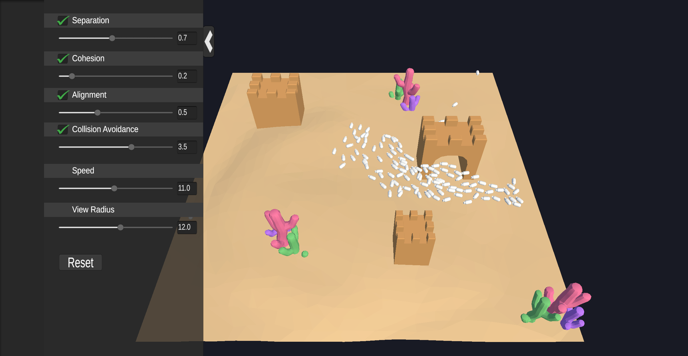
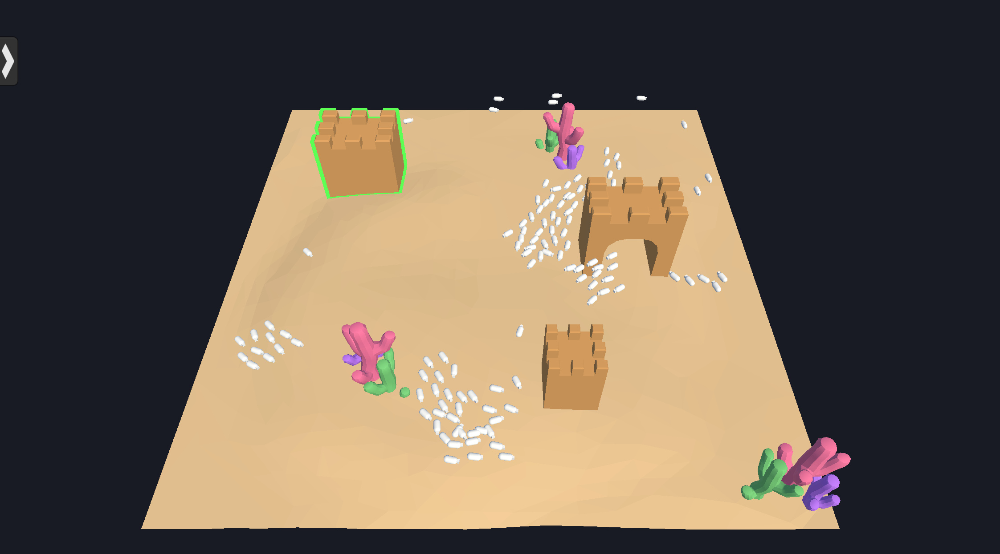
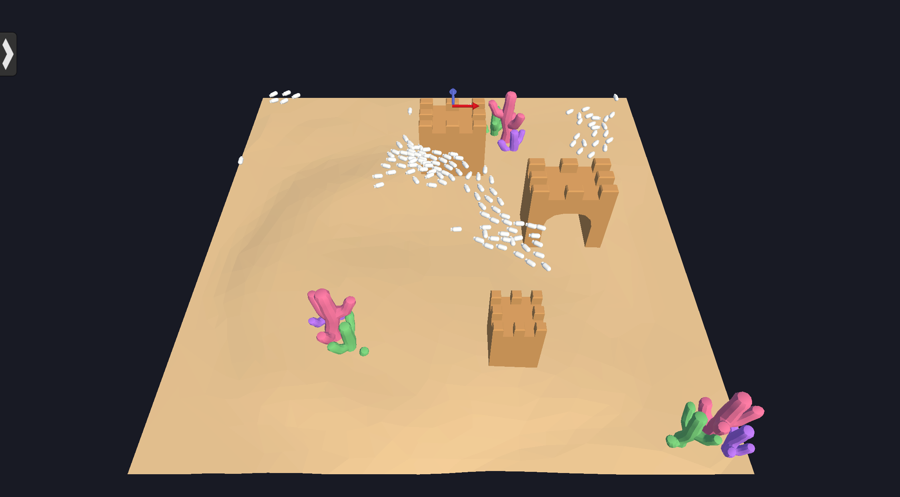

# COMP3180 Final Project

Included is a rough timeline below. Fill this in from week to week to show your progress throughout semester.

<details>
  <summary>Markdown formatting tips (Click to expand)</summary>
  Below are a number of tips for adding images and other formatting to your journal. We recommend you give them all a go. You can remove this section from your journal when you are done with it.

  ## Inserting images
  You can (and should!) insert images into your journal. To do so, place the images inside a folder within your repo and insert them using the following template, replacing text in "<>" appropriately:
  ```
  
  ```
  For example:
  ```
  
  ```
  ## Inserting Quotes
  Quotes can be a useful way to add sections from your readings into your journal for reference later. To add them, place a ">" marker in front of each line (or using `<br>` to seperate them). Example:

  > This is the first line of my awesome quote!<br>And here is another line! How cool!

  No marker here, so the quote is broken. But I can bring it back...
  > Like this!

  ## Inserting Code
  Code snippets can be a good way to place algorithms, formulas or other such things into your documentation for illustrative purposes (or if your project requires installation instructions). You can insert code by placing three backticks (```) above and below the code breakout. Like this:

  ```
  if (noCoffee)
  {
    coffeePot.refill();
  }
  ```
  If you want to add a very short snippet of code into a paragraph, you can instead use single Backtick, `Like this!`.

  Please let us know if you need help doing anything else in Markdown!
</details>

## Week 1 - Selecting a Project

Chosen Topic - AI 
I want to delve into advanced creature AI. Either a herd for an ecology game, or an advanced enemy AI in an action game

## Week 2 - Narrowing Focus & Tool Familiarisation

Book identifying and explaining some algorithms for swarm AI: 
https://link.springer.com/content/pdf/10.1007/978-3-319-91341-4.pdf

I have started in-depth research into the topic of simulating flock movement.

The current algorithm of interest is the BOIDS model, one of the first widely accepted models for simulating flock behaviour (birds, schools of fish, etc.), which works by balancing the flight path of individual flock members based on 3 priorities: Collision Avoidance, Velocity Matching, & Flock Centering. 

The original paper on the boids model, which I am currently reading and trying to understand, can be found here: 
https://dl.acm.org/doi/abs/10.1145/37401.37406
 
Another (very big) resource I found on AI algorithms is: 
https://www.oreilly.com/library-access/?next=/library/view/ai-for-games/9781351053280/

This will need to be skilled for relevant information, as it is a 1000 page book. 

## Week 3 - Research (Reading & Prototyping)

Overview:
- This week I did A LOT of reading, writing and note taking
- Overall, I think I pretty much understands the BOIDs model and the general procedure of how everything works. The only "usure" part i've encounter is obstacle avoidance and algorithms for "looking" at all the boids next to you, to which I have encounter 3 different methods for both of them (none of which I dived too deep into)
- I've slightly changed my concept from a flock of birds to a school of fish. Inspired by games like Abzu, the thought of making something similar (and maybe, for myself, replace the fish models with pokemon) was more motivating than a flock of birds. 
- My goal for next week is to start prototyping a 3D BOIDs model. Initially, I will make it 2D by not allowing movement along the Z axis, but after getting some basic code working, will add that in to make it proper 3D. 
- Hopefully by next week, I will have basic 3D movement and flocking simulation (with cohesion, alignment, and separation). Things that I dont plan on including for next weeks prototype are advanced forms of obstacle avoidance, code optimization in terms of "neighbourhood" search algorithms. Additionally, as I will detail below, there is a lot of additional tweaking, math, and parameters that I can add to better simulate the movement of fish specifically (Different detection ranges, dynamically changing radii, etc). I do not plan on adding these, it will just be a model of the basic functionalities outlined in Craig's original paper
- Updated my notes document in the repo 

Below are the different resources I've read and watched throughout the week 

David Hahn Flock Simulation
https://ddavidhahn.github.io/cs184_projfinal/

- A basic 2D implementation of the BOIDS model developed by Craig. 
- Most of the content is derived from or re-explanations of ideas in Craig's additional paper, so there's not much new information there. 
- The breakdowns of the magnitudes and detection radii they used for the 3 factors might be of use though, as well as their method of implementing avoidance and attracting entities.
- HOWEVER, they directed me to another, better flocking simulation by Emilee Chen & Kelly Cho 

Emilee Chen & Kelly Cho 2D Fish Flocking Simulator
https://www.emileechen.com/projects/flocking/

- Actually just David Hahn's flocking simulator but smoother, and with additional tweaks to better mimic fish specifically
- Most of it is the same ideas that were is Craig's and David's simulations. 
- HOWEVER, they had more details on (a) A secret, 4th factor in the calculations called Cruise, (b) they had more complicated "sigh cones" for the different factors (alignment, cohesion, separation) to better mimic a fish's senses, and (c) the radii of all of these sigh consed dynamically changed based on neighbourhood density. 
- HOWEVER, all of these additional, fish-specific changes, originated from ANOTHER paper, which I read: 

Self-Organized Shape and Frontal Density of Fish Schools
https://pure.rug.nl/ws/files/86301693/Hemelrijk_et_al_2008_Ethology.pdf
- This paper is LITERALLY a paper about taking Craig's BOIDS model and adapting it to better suit fish specifically 
- Has more detailed instructions, reasoning, explanations, and math behind the BOIDS model changes I talked about in Emilee's simulation 
- Although I get everything conceptually, the nitty gritty details of the math itself kind of flew over my head a bit (i'm not good at reading these things). I plan on actually decoding the math when it's time to implement these things in code.
- And after understanding everything conceptually, I am also very very worried about the amount of computation and proceccing power needed to run all the calculations in this model specifically. 
- They cited a special algorithm that they used to detect nearby neighbours that apparently helps it be less computationally expensive, but I haven't looked into it yet. 
- The paper also contains neat citations into the biological movement patterns observed in real fish, if I ever need those, as well as what mathematical values for the simulation seemed to best replicate that. 

Steering Behaviours for Autonomous Characters (Craig Reynolds Again) 
https://citeseerx.ist.psu.edu/document?repid=rep1&type=pdf&doi=9d19157fa8da0a7d216f44d6a45a73b59b6da23f

- This is another paper that the Emilee Chen simulation directed me to
- Another Craig Reynolds paper (creator of the BOIDS model), and apparently the basic movement schemes used in the BOIDs model are based off this paper
- It is basically a paper that presents an algorithm for semi-autonomous movement, talking about concepts like seeking and feeling behaviours, etc. 
- Not gonna lie, I got 3 pages into this before my brain kind of died. The topic itself isn't that complicated, but I think just how it's worded and presented REALLY did not sit well with my brain, I couldn't quite understand anything he was saying or trying to model. 
- SO, I turned to youtube, which took me to my next resource, which explained everything in this paper in really nice and clear words. 

The Coding Train Playlist: 
https://www.youtube.com/playlist?list=PLRqwX-V7Uu6YHt0dtyf4uiw8tKOxQLvlW
- A playlist of 10 videos, for a total of about 2 and a half hours worth of content, by a youtube channel called The Coding Train
- Basically video lectures covering the previous paper, as well as Craig's paper on BOIDS too 
- Made by Daniel Shiffman, a Coding Professor at NYU and a member of the Board of Directors of the Processing Foundation
- Very good teacher, explained everything in nice words with clear examples, and after watching these videos I think I've understood everything I need to know to get a very basic version of the BOIDS model simulation, math included
- Also has a github repository of ALL of the code he used for the demos. It's code done in processing, but even just seeing the math and steps he took will definitely be very handy for me. 
- Love this playlist, 10/10, I completely understand Craig's algorithms of Steering Behaviours that BOIDS models are built upon. 

Other Thoughts
- In the near future, optimization to make all these calculations less expensive will definitely be a problem for me. Especially the part where I look for all the neighbours of each individual BOID
- Avoiding obstacles might also be a problem for me depending on my final scope for the project. If it's as simple as dropping one or two obstacles into the scene and having them steer away from those, it's easy enough. 
- But if I model terrain (let's say, a coral reef), with a lot more varied, wacky terrain, and a very large amount of obstacles, it might be a problem. I've vaguely peeked around and have already seen 3 different ways of doing the obstacle detection and avoidance. 


## Week 4 - Research (Reading & Prototyping)

Overview

- I did the project presentation this week 
- I spent a good chunk of time trying to research what improvements were made to BOIDS in recent years. Not much, the algorithm principles itself are solid, the only real improvements are in the optimization of its neighbour-querying process. Main improvements are parallel programming and/or implementing object independent spatial subdivision. 
- Next week I plan to start implementing the boids algorithm. The base, original one first in 2D. Once I have that working, I'll upgrade it to 3D, and try out the different "fish-specific" 


Project Presentation
I did the project presentation video this week. Went from 0% to 100% done within the week, so, that took up a good chunk of my time. Especially finding recent papers and sources to use for the presentation. 
I definitely stressed a bit too much about it, especially about finding and citing sources for everything. I spent SO LONG finding the original source of when someone on the team of Hitman:Absolution said they used Craig Reynolds and BOIDS for the crowds (it was mentioned in a 2012 GDC presentation someone on the team game), only to realise you guys probably don't care much about about having the firsthand source for a 4 second part of the introduction where I mentioned BOIDS were used for Hitman. 

Resources I read into: 
1000 Page book about AI in games
https://learning.oreilly.com/library/view/ai-for-games/9781351053280/xhtml/08_Chapter01.xhtml#ch1-1-2
- I haven't finished fully reading it (and I don't know if I will continue) but I've read most of chapter 3. 
- Reading it took awhile (very big book). 
- It repeats a lot of the other things that i've already read about, but it's nice seeing a 2019 still talk about BOIDS and how it's still relevent
- Has really useful pseudocode for implementing Craig's steering behaviours. 
- Also has a bigger focus on single-object pathfinding and steering behaviours in general, but points out some interesting things in the ways of advanced pathfinding and ray-dependant collision avoidance that I might need to revisit for implementation in my simulation

"Uniform Spatial Subdivision to Improve Boids Algorithm in a gaming environment"
https://www.ijarnd.com/manuscripts/v3i10/V3I10-1144.pdf
- a 2018 research paper where they try to improve the performance of the algorithm with a specific kind of object independent spatial subdivision.
- Really useful research paper, especially their RRL. In their RRL they justify why the neighbour-querying aspect of the BOIDS algorithm is the one that needs the most improvement, and lists all of the major ways that people have tried to improve it over the years 
- Asider from the spatial subdivision, they implement an additional functionality to avoid the worst-case scenario for the algorithm by saying "this division can have max X boids, if this division is full, do not move the boids here" 
- Also just explained what spatial subdivision in general was to me. 

I did look at a bunch of other sources, but, there's a lot of things that I skimmed and found nothing of note and nothing interesting. I really tried to find more recent sources, and I found a few, but, BOIDS is still used even today, and the only thing that's improved are the algorithms for neighbour querying. 
Some paper did look into complex algorithms for neighbour querying, but even skimming over it for a bit made me realize that it is way to complicated for me to implement within the scope of this project (especially Quadtrees and Octrees), so I barely took any notes on them. 

## Week 5 - Presentations (& research/rescoping)

Overview:
- No new research or note taking
- Started coding a basic scene: Movement, sight cones/neighbour detection, and basic collision avoidance (with raycasting) implemented. 
- Hoping to actually add group behaviours this week 

Code details
- Basic scene implemented with BOIDS moving kinematically. 
- Single raycast so far for collision detection. Simple direction changing upon predicting collision with a wall, this system wont work with curving/more organically shaped terrain. 
- Also no collision avoidance with other boids yet
- So far, boids have a sight cone implemented, and every FixedUpdate() does a collision check to see who is within a _ radius sphere from them. "colliding" boids in their sight cone have their transforms stored in an array list. 

Thoughts:
- Not too many thoughts yet. I've just implemented a string of basic things, didn't struggle with anything in particular 
- I predict i'll struggle this week since now I'll be actually implementing the complicated maths 
- Didn't do as much work as I would have liked this week because my entire weekend was booked (attended someone's wedding). 

## Week 6 - Presentations (& research/rescoping)

Overviwew:
- Implemented base flocking behaviours: Cohesion, alignment, separation
- No advanced collision detection yet
- Implemented a priority system for combining steering behaviours
- Next week plan on implementing triple raycast collision detection, dynamic view radius, and some more experimentation

BOIDS: Cohesion, Alignment, Separation
- All three were successfully implemented. 
- I felt a bit lost at first cause it quite the long multi-step plan to implement all these behaviours and i was just intimidated on how to start
- Implemented a basic version of all 3 that took the average ___ of neighbouring boids and then -> converted that into a system that took the average weighted by distance then ->  looked at resources to find better/more accurate formulas to get that distance weighted average. 
- Overall i still have a few doubts that I implemented this system 100% right, but, it works pretty well!!
- The one I am most unsure about is how I implemented alignment, I'm getting the right values going in the right direction, but, I'm just unsure about how I combine them all together. Should the alignment vector really be outputting a vector of MaxSpeed magnitude every frame? Im worried that my alignment vector output is too strong in relation to the other two
- Additionally, the boids seem to spasm left and right rn because of separation. It kinda works cause it looks like fish swimming, but, if I wanted to remove their anxiety I would have to do collision prediction and only react if it predicts that they would collide. 

Combining steering behaviours
- Initially implemented a simple weighted average system, where it would take the 3 vector outputs, weight them by some picked value, and combine them + limit its magnitude 
- Eventually upgraded to implement a priority system, with priorities being Separation > Cohesion > Alignment. Basically, it fulfills the separation vector first, then if there is still speed left to spare, fulfills the following priorities
- The priority system SEEMS to result in a better simulation. It is kind of hard to tell since "testing" it consists of me sitting there and watching the BOIDS for prolonged periods of time. So to me, the simulation with this system seems better
- I am also a bit doubtful that I 100% implemented the priority system correctly, but, again, it seems to work pretty well! 
- There are some minor weird things i see, but that might be fixed with the implementation of other things to come

Bounds handling and collision detection
- Changed the bounding box so that when the BOID reaches the edge it just teleported them to the other side
- Did this because i didnt have raycast collision detection working yet. 
- That raycast is the next thing I want to do. Following the breakdown in one of my resources, i plan on doing one main raycast out the boid and two shorter, tilted out "whiskers." 

## Week 7 - Research Report Finalisation

Not much progress on the actual project this week. All I did was the research report


## Week 8 - Project Development
A lot of progress on the project 

1. Rewrote a chunk of the code (again) to be more efficient 
2. Added raycast-based obstacle avoidance to the BOIDS 
3. Combined the obstacle avoidance with the other flocking behaviours 

This week I referenced Sebastiang Langue's work on BOIDS a lot to organize and better streamline my own code. I cleaned it up a lot as there were a lot of leftover artefacts, bits of code, and values from when I was still figuring the whole thing out. 

Implementing collision detection took awhile... I tried a certain approach for awhile, before realizing that it was inherently flawed and wrong. I then completely rewrote it following the collision detection that I had seen is Sebastian Langue's videos. I remember getting tripped up on the vector math a lot, especially the quaternions. It was also a lot of trial and error to see what values worked best. 

Lastly, I combined this collision avoidance with the other flocking behaviours. This, again, took a long while. I originally had tried to combine it with a priority-based blending system, as was outlined in Craig's papers, but I found great difficulty in implementing it in a way that looked good. Eventually, I gave up and reverted to a regular weighted blending form of combining steering behaviours. This produced pretty good results, so I stuck with it. 

I am quite... dissapointed? regretful? of all the useless code I wrote only to throw away. Maybe if I hadn't tried a priority-based blending system, I would be father into the project, or it I had gotted the collision detection system right the first time. 


## Mid-semster break 1 - Continued R&D

## Mid-semster break 1 - Continued R&D

## Week 9 - Project Development

Overview
This week was implementing the following in-game UI elements. 

Parameters Panel
1. You can open and close a tab with sliders to edit some of the values used by the BOIDS simulation. Current values that can be edited are the weight of the Cohesion, Alignment, Separation, and Collision Avoidance vectors. 
2. You can type input directly into the boxes next to the sliders and hit enter to change the value. 
3. There are tick boxes next to the names of some of the parameters to instantly enable/disable them 
4. You can click on the arrow to the right of the panel to close it again 

    ```
  
    ```

Obstacles
- I modelled a coral decoration in blender and imported it into the scene. Wasn't hard since I am fairly familiar with how to use blender and import assets from it into unity
1. When the cursor hovers over obstacles in the scene, they gain an outline. 
2. Clicking on an obstacle makes arrows pop up
3. Holding down click above the arrows and dragging the cursor allows you to move the obstacle in the corresponding axis. 

    ```
  
    ```

    ```
  
    ```

Additionally, I adjusted some of the visuals of the project. Changed the background color and the model for the ground so it's not just a flat plane. 

In-Depth Thoughts

Parameters Panel
- Was ok to implement. It took awhile, mainly cause I haven't done something like this before and had to search up how to do it. Actually adding it was fairly easy, but tedius. 
- Aside from the actual UI i hade to make a few more script changes to acoomodate for: changing the values in all the BOIDS, Setting the values in the parameters panel to mach the ones in GameManager at the start, etc. 
- Still need to add some more parameters to the panel. Should be easy though since all the framework is done and the prefabs are made. 
- I think that the parameters panel is ugly, and in terms of UI design could use so much work. But it's serviceable. As it is no the focus of my project i don't think I'll expend extra time and effort to make it pretty. 

Obstacle movement UI 
- Was a lot trickier than the parameters panel, and took quite a bit of time. 
- Having the item that you mouse over get highlightes was a bit tricky. I did something similar with an old project but it's still tricky haha. Originally tried making a material out of a ShaderGraph as suggested by one of the tutorials that I found on youtube. Uhm, it didn't work out ;-; That tutorial only seems to work for extremely simple meshes like the base cube, not the corals that I made. In the end I did the same thing that I did for items in Ransack, another project of mine in another subject. I made another item with a different material and made it so that it always renders unter the base item by tweaking the URP render settings. 
- Implementing the arrows showing up above the item, and them having a highlight color and everything was also  fairly straightforward and easy to implement. 
- However, actually MOVING the obstalce with the mouse drag was tricky and I never found out a 100% foolproof way to do it. My problem was, since the camera was a perspective camera, using ScreenToWorldSpace to get how much the mouse moved and move the obstacle accordingly resulted in it moving at different rates if it was an object at the back vs an object in the front. Never figured out a "proper" way to do this... i just edited the maths a lot 

## Week 10 - Project Development

Overview: 
This week was tweaking the BOIDS values and code a little bit more + finishing off the UI

UI
1. Added more parameters to the parameters pannel (speed & view range)
2. Added a reset button to the parameters table that resets it to the original values

Decoration  
1. Made a sandcastle for decoration. Has a version with a door and a version without. 

BOIDS
1. Added cruise speed - a speed at which the BOIDs prefer to move at, but they can speed up or slow down when needed. 
2. Tweaked the vector outputs of the BOIDs to accomodate for the cruise speed
3. Played around A LOT with the values in the simulation, 
4. Made a spawner for the BOIDs that spawns x amount when the scene is started
5. Implemented dynamic ViewRadius. The denser a BOIDs view cone, the lower his ViewRadius gets
6. Tried adjusting it further but it made me lose frames so I undid it

In-Depth thoughts

UI
- It wasn't hard to add the new parameters to the UI, especially since I did most of the legwork last week. I just had to copy some code, add some more prefabs, etc. 

Decoration
- Making and adding the sandcastle wasnt hard either. Fairly quick to make and implement

BOIDS
- Cruise speed took some thinking and staring at the screen to add. i was mainly stuck on the methodology of how i'd implement it, the actual codings did use anything crasy that I havent done before. Still just more maths. It took a look ot tinkering to figure out which speed values felt right though. 
- What was time consuming though was subsequently experimenting with adjusting the magnitude of the vector outputs to get something that worked well with the cruise speed. Since the speed is now variable, I can't simply clamp vector outputs to a MaxSpeed, and setting their weights too high would render the cruiseSpeed fairly useless. Not HARD per say, jsut time consuming and a lot of debug logs.
- Not too many thoughts for the BOID spawner. Just had to think a bit because spawning two boids in the exact same place caused errors somewhere in the BOID math. 
- They dynamic ViewRadius was really easy to implement. I already kept track of all the boids in the neighbourhood, so i just had to reducet the ViewRadius by some number per boid in there. 

Overall my thoughts on the project are... okay. There's a lot of things in the original plan that didn't make it here: movement along the Y axis, things to optimize the algorithm, etc. But, i still made a fair amount of progress on the project.
Currently I can have about 400 boids before I start to run into performance issues. 

## Week 11 - Project Evaluation

This week was pretty much just preparing for evaluation. The final BOIDS program that I'm going to use was done last week. All I did this week was
- Make the google forms questionnaire for the evaluation
- Replaced the old BOIDs capsules with actual fish models 
- Further adjusted parameter to what I think looks better. 

For the boids models, i took a them from a free asset pack from the unity store. it's an extension license type asset so it should be good to use for this
https://assetstore.unity.com/packages/3d/characters/animals/fish/fish-polypack-202232

Additionally, here's the link to the google forms 
https://docs.google.com/forms/d/e/1FAIpQLSdNoMQ8dcYRNBP4tFnlc6f2H4HTM1Gru13XxwglMRSAejKt6w/viewform

## Week 12 - Project Evaluation

This week was also just all about having people answer the google forms survey. Based on responses so far the project is fairly successful, people seem to agree that it looks fairly realistic. 

I also started working on the final report

## Week 13 - Project Report & Deliverables Finalisation

I finished up all the documentation needed for the unit: Final report, playtesting report, demo video etc. 

I uploaded the demo video on youtube, it's here; 
https://youtu.be/FjnkfPxM0uA